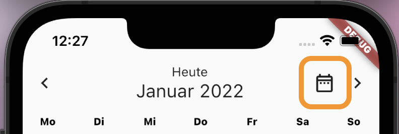
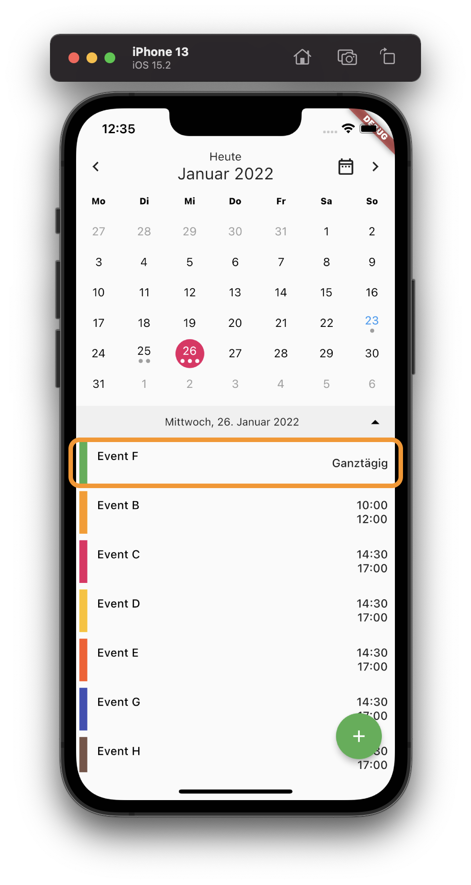

# flutter_neat_and_clean_calendar


Simple flutter calendar based on [flutter_clean_calendar](https://github.com/pmcarlos/flutter_clean_calendar) package.
This package offers some extra functionality. It introduced a new **NeatCleanCalendarEvent** object, that gets used as the data component transfered the calendar widget as a parameter. So it is possible now to color the dots in the **Calendartiles** with a color corresponding to the event. 

The event list below the calendar view is generated bei the package. Here the extra data of the **NetCleanCalendarEvent** objects again come into play. 

The package is highly customizable.


The calendar view shows a list of events for the selected date. This list view supports **three different types of events:**

* Single day event (starts and ends at certain time on a single day)
* All-day events (Span over a full day with no specific start and end time, property `isAllDay`)
* Multi-day events (Start at a specific time on one day and end at a specific time on another day, property `isMultiDay`)


The property `isAllDay` has a higher priority than 'isMultiDay'. This means, that when you set `isAllDay` to `true` for an event, it will show up in the events list als all-day event without start and end times, no matter if `isMultiDay` was also set to `true`.

You can include images in calendar events. The property `icon` takes a String of the image name. This parameter is optional. 

To control the width of the image you can use the property `wide`, which is a bool. 

## Usage

Embed the 'Calendar' widget in a column. Below the calendar (as the second widget in the Column) place a 'ListView.builder' widget for rendereing the list of events.

### Set dependency

```
dependencies:
  flutter_neat_and_clean_calendar: ^0.3.0+12
```

### Install

```
flutter pub get
```

### Import it

```dart
import 'package:flutter_neat_and_clean_calendar/flutter_neat_and_clean_calendar.dart';
```

### Use it

```dart
Widget build(BuildContext context) {
  return Scaffold(
    body: SafeArea(
      child: Calendar(
        startOnMonday: true,
        weekDays: ['Mo', 'Di', 'Mi', 'Do', 'Fr', 'Sa', 'So'],
        eventsList: _eventList,
        isExpandable: true,
        eventDoneColor: Colors.green,
        selectedColor: Colors.pink,
        selectedTodayColor: Colors.red,
        todayColor: Colors.blue,
        eventColor: null,
        locale: 'de_DE',
        todayButtonText: 'Heute',
        allDayEventText: 'Ganztägig',
        multiDayEndText: 'Ende',
        isExpanded: true,
        expandableDateFormat: 'EEEE, dd. MMMM yyyy',
        datePickerType: DatePickerType.date,
        dayOfWeekStyle: TextStyle(
            color: Colors.black, fontWeight: FontWeight.w800, fontSize: 11),
      ),
    ),
    floatingActionButton: FloatingActionButton(
      onPressed: () {},
      child: const Icon(Icons.add),
      backgroundColor: Colors.green,
    ),
  );
}
```

For more details see the **example**.
## Properties

```dart
/// [onDateSelected] is of type [ValueChanged<DateTime>] and it containes the callback function
///     extecuted when tapping a date
/// [onMonthChanged] is of type [ValueChanged<DateTime>] and it containes the callback function
///     extecuted when changing to another month
/// [onExpandStateChanged] is of type [ValueChanged<bool>] and it contains a callback function
///     executed when the view changes to expanded or to condensed
/// [onRangeSelected] contains a callback function of type [ValueChanged], that gets called on changes
///     of the range (switch to next or previous week or month)
/// [onEventSelected] is of type [ValueChanged<NeatCleanCalendarEvent>] and it contains a callback function
///     executed when an event of the event list is selected
/// [onEventLongPressed] is of type [ValueChanged<NeatCleanCalendarEvent>] and it contains a callback function
///     executed when an event of the event list is long pressed
/// [datePickerType] defines, if the date picker should get displayed and selects its type
///    Choose between datePickerType.hidden, datePickerType.year, datePickerType.date
/// [isExpandable] is a [bool]. With this parameter you can control, if the view can expand from week view
///     to month view. Default is [false].
/// [dayBuilder] can contain a [Widget]. If this property is not null (!= null), this widget will get used to
///     render the calenar tiles (so you can customize the view)
/// [eventListBuilder] can optionally contain a [Widget] that gets used to render the event list
/// [hideArrows] is a bool. When set to [true] the arrows to navigate to the next or previous week/month in the
///     top bar well get suppressed. Default is [false].
/// [hideTodayIcon] is a bool. When set to [true] the dispaly of the Today-Icon (button to navigate to today) in the
///     top bar well get suppressed. Default is [false].
/// [hideBottomBar] at the moment has no function. Default is [false].
/// [events] are of type [Map<DateTime, List<NeatCleanCalendarEvent>>]. This data structure containes the events to display
/// [defaultDayColor] is the color applied to days in the current month, that are not selected.
/// [defaultOutOfMonthDayColor] is the color applied to days outside the current month.
/// [selctedColor] this is the color, applied to the circle on the selcted day
/// [todayColor] this is the color of the date of today
/// [todayButtonText] is a [String]. With this property you can set the caption of the today icon (button to navigate to today).
///     If left empty, the calendar will use the string "Today".
/// [allDayEventText] is a [String]. With this property you can set the caption of the all day event. If left empty, the
///     calendar will use the string "All day".
/// [multiDayEndText] is a [String]. With this property you can set the caption of the end of a multi day event. If left empty, the
///    calendar will use the string "End".
/// [eventColor] lets you optionally specify the color of the event (dot). If the [CleanCaendarEvents] property color is not set, the
///     calendar will use this parameter.
/// [eventDoneColor] with this property you can define the color of "done" events, that is events in the past.
/// [initialDate] is of type [DateTime]. It can contain an optional start date. This is the day, that gets initially selected
///     by the calendar. The default is to not set this parameter. Then the calendar uses [DateTime.now()]
/// [isExpanded] is a bool. If is us set to [true], the calendar gets rendered in month view.
/// [weekDays] contains a [List<String>] defining the names of the week days, so that it is possible to name them according
///     to your current locale.
/// [locale] is a [String]. This setting gets used to format dates according to the current locale.
/// [startOnMonday] is a [bool]. This parameter allows the calendar to determine the first day of the week.
/// [dayOfWeekStyle] is a [TextStyle] for styling the text of the weekday names in the top bar.
/// [bottomBarTextStyle] is a [TextStyle], that sets the style of the text in the bottom bar.
/// [bottomBarArrowColor] can set the [Color] of the arrow to expand/compress the calendar in the bottom bar.
/// [bottomBarColor] sets the [Color] of the bottom bar
/// [expandableDateFormat] defines the formatting of the date in the bottom bar
/// [displayMonthTextStyle] is a [TextStyle] for styling the month name in the top bar.
/// [datePickerConfig] is a [DatePickerConfig] object. It contains the configuration of the date picker, if enabled.

final ValueChanged<DateTime>? onDateSelected;
final ValueChanged<DateTime>? onMonthChanged;
final ValueChanged<bool>? onExpandStateChanged;
final ValueChanged? onRangeSelected;
final ValueChanged<NeatCleanCalendarEvent>? onEventSelected;
final ValueChanged<NeatCleanCalendarEvent>? onEventLongPressed;
final bool isExpandable;
final DayBuilder? dayBuilder;
final EventListBuilder? eventListBuilder;
final DatePickerType? datePickerType;
final bool hideArrows;
final bool hideTodayIcon;
@Deprecated(
    'Use `eventsList` instead. Will be removed in NeatAndCleanCalendar 0.4.0')
final Map<DateTime, List<NeatCleanCalendarEvent>>? events;
final List<NeatCleanCalendarEvent>? eventsList;
final Color? defaultDayColor;
final Color? defaultOutOfMonthDayColor;
final Color? selectedColor;
final Color? selectedTodayColor;
final Color? todayColor;
final String todayButtonText;
final String allDayEventText;
final String multiDayEndText;
final Color? eventColor;
final Color? eventDoneColor;
final DateTime? initialDate;
final bool isExpanded;
final List<String> weekDays;
final String? locale;
final bool startOnMonday;
final bool hideBottomBar;
final TextStyle? dayOfWeekStyle;
final TextStyle? bottomBarTextStyle;
final Color? bottomBarArrowColor;
final Color? bottomBarColor;
final String? expandableDateFormat;
final TextStyle? displayMonthTextStyle;
final DatePickerConfig? datePickerConfig;
```

## Sample event data

The syntax of the event map changed due to the introduction of the 'NeatCleanCalendarEvent' class.

```dart
final List<NeatCleanCalendarEvent> _eventList = [
  NeatCleanCalendarEvent('MultiDay Event A',
      startTime: DateTime(DateTime.now().year, DateTime.now().month,
          DateTime.now().day, 10, 0),
      endTime: DateTime(DateTime.now().year, DateTime.now().month,
          DateTime.now().day + 2, 12, 0),
      color: Colors.orange,
      isMultiDay: true),
  NeatCleanCalendarEvent('Allday Event B',
      startTime: DateTime(DateTime.now().year, DateTime.now().month,
          DateTime.now().day - 2, 14, 30),
      endTime: DateTime(DateTime.now().year, DateTime.now().month,
          DateTime.now().day + 2, 17, 0),
      color: Colors.pink,
      isAllDay: true),
  NeatCleanCalendarEvent('Normal Event D',
      startTime: DateTime(DateTime.now().year, DateTime.now().month,
          DateTime.now().day, 14, 30),
      endTime: DateTime(DateTime.now().year, DateTime.now().month,
          DateTime.now().day, 17, 0),
      color: Colors.indigo),
];
```

**CAUTION**: from v0.3.0 on the preferred way to set the calendar events is to provide a list (property `eventsList`). You can still use a map (property `events`) to do this, but this functionality is **DEPRECATED** and will get **removed from v0.4.0 on**.

## Examples

### Basic widget with customized colors

Some colors were cutomized in this example:

```dart
Calendar(
  eventDoneColor: Colors.green,
  selectedColor: Colors.pink,
  todayColor: Colors.blue,
  eventColor: Colors.grey,
)
```


### Display a date picker to jump to a certain date

```dart
Calendar(
  datePickerType: DatePickerType.date
)
```
These options are available:
* 'DatePickerType.date'
* 'DatePickerType.year'
* 'DatePickerType.hidden'

If you set the option to 'DatePickerType.date' or 'DatePickerType.year' an icon to load the date picker is shown.



Pressing this button opens a date picker, that allows the user to jump to a certain date.

If you set the option to 'DatePickerType.hidden' no icon is displaysed. This logic replaces the option 'isJumpDateButtonEnabled' which was present in earlier releases.

### Handling all-day events

The class `NeatAndCleanCalendarEvent` has a boolean property called ìsAllDay`. This property allows you to 
define events, that last all day with now start or end time. These events get sorted at the top of the 
events list.



With the property `allDayEventText` you define the string displayed for that type of events. If you
don't set this option the calendar will display `All day` for these events.

### Expandable calendar view

```dart
Calendar(
  isExpandable: true;
)
```


### Custom day builder


```dart
Calendar(
  // A builder function that renders each calendar tile how you'd like.
  dayBuilder: (BuildContext context, DateTime day) {
      return new Text("!");
  },
)
```


### Custom event list builder


```dart
Calendar(
  // A builder function that renders the event list
  eventListBuilder: (BuildContext context,
      List<NeatCleanCalendarEvent> _selectesdEvents) {
    return new Text("!");
  },
)
```


